# drm框架

linux使用drm作为图形子系统, 统一管理gpu, display controller, 功能包含图形显示, 渲染, 图形内存管理等
源码位置: drivers/gpu/drm

# 目录

- [1. 图像](#1-图像)
  - [1.1 像素](#11-像素)
  - [1.2 RGB](#12-rgb)
    - [1.2.1 常见RGB格式](#121-常见rgb格式)
  - [1.3 图像](#13-图像)
- [2. DRM架构](#2-drm架构)
  - [2.1 框架模型](#21-框架模型)
    - [2.1.1 用户态与内核态](#211-用户态与内核态)
    - [2.1.2 内核态核心结构](#212-内核态核心结构)
- [3. DRM 内存管理](#3-drm-内存管理)
  - [3.1 内存管理分类](#31-内存管理分类)
  - [3.2 TTM (The Translation Table Manager)](#32-ttm-the-translation-table-manager)
  - [3.3 GEM (The Graphics Execution Manager)](#33-gem-the-graphics-execution-manager)
    - [3.3.1 GEM CMA](#331-gem-cma)
    - [3.3.2 GEM SHMEM](#332-gem-shmem)
    - [3.3.3 GEM VRAM](#333-gem-vram)
  - [3.4. 内存管理使用](#34-内存管理使用)
- [4. DRM KMS](#4-drm-kms)
  - [4.1 Kernel Mode Setting(KMS)](#41-kernel-mode-settingkms)
  - [4.2 Mode Config](#42-mode-config)
  - [4.3 FrameBuffer](#43-framebuffer)
  - [4.4 Plane](#44-plane)
  - [4.5 Crtc](#45-crtc)
  - [4.6 Encoder](#46-encoder)
  - [4.7 Connector](#47-connector)
- [5. 驱动流程以及调试问题](#5-驱动流程以及调试问题)
  - [5.1 版本](#51-版本)
  - [5.2 驱动编写流程](#52-驱动编写流程)
  - [5.3 应用层使用流程](#53-应用层使用流程)
  - [5.4 调试工具](#54-调试工具)
    - [5.4.1 drm debug打印](#541-drm-debug打印)
    - [5.4.2 modetest工具](#542-modetest工具)
      - [5.4.2.1 编译](#5421-编译)
      - [5.4.2.2 使用](#5422-使用)
    - [5.4.3 Xorg 日志](#543-xorg-日志)
  - [5.5 问题](#55-问题)
    - [5.5.1 Xorg 库与配置文件](#551-xorg-库与配置文件)
      - [5.5.1.1 Xorg 库](#5511-xorg-库)
      - [5.5.1.2 配置文件](#5512-配置文件)
    - [5.5.2 内存管理选择](#552-内存管理选择)
    - [5.5.3 ATOMIC 特性设置与Xorg不兼容](#553-atomic-特性设置与xorg不兼容)
    - [5.5.4 设置分辨率](#554-设置分辨率)
      - [5.5.4.1 设置分辨率](#5541-设置分辨率)
- [X. 参考文档及源码](#x-参考文档及源码)

# 1. 图像

## 1.1 像素

一个像素点通常由RGB三原色组成, 通过不同RGB比例混合, 达到相应颜色

## 1.2 RGB

RGB指的是R(red)红色、G（green）绿色、B（blue）蓝色，三种颜色;目前来说，所有的颜色都可以用这三种颜色配出来

通常使用不同位数表示RGB深度

### 1.2.1 常见RGB格式

1. RGB555, RGB分别使用5bit表示
2. RGB565, RB使用5bit表示, G使用6bit表示
3. RGB888, RGB分别用bit表示
4. RGB32, RGB各占8bit, 剩下8位用作Alpha通道或者不用, Alpha通道是一个8位的灰度通道，该通道用256级灰度来记录图像中的透明度信息

内存中存放

| 高地址 |  |  | 低地址 |
| :---: | :---: | :---: | :---: |
| A (n 位 / 不使用) | R (n 位) | G (n 位) | B (n 位) |

## 1.3 图像

多数显示器选择从左上角开始, 从左至右, 到了右边界, 再偏转到左边界的下一行, 这是所谓的”Z”型扫描. 类似地扫描完最后一帧时, 要偏转回左上角起始处, 准备扫描下一帧

HSYNC 信号用于告诉电子枪该扫描下一行了, 即要转到下一行起始处了

VSYNC 信号告诉电子枪该显示下一帧了, 即该转回左上角起始处了

扫描一行为例:

如下图所示

[hv]display, 对应屏幕分辨率

[hv]sync_start, 对应sync信号开始时像素点, 显示完成一行后, 到发出sync信号之前, 存在空白数据(Front Porch不显示)

[hv]sync_end, 对应sync信号结束时像素点, 发出sync信号后, 到下一行显示数据之前, 存在空白数据(Back Porch 不显示)

[hv]tota, 对应整个屏幕包含空白数据的总像素点

[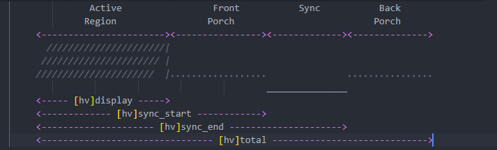](./pic/drm/hsync-vsync.PNG)

VGA常见参数如下

以640*480@60为例

```markdown
hdisplay = 640

hsync_start = 640 + 8 + 8 = 656

hsync_end = 640 + 8 + 8 + 96 = 752

htotal = 640 + 8 + 8 + 96 + 40 + 8 = 800
```

[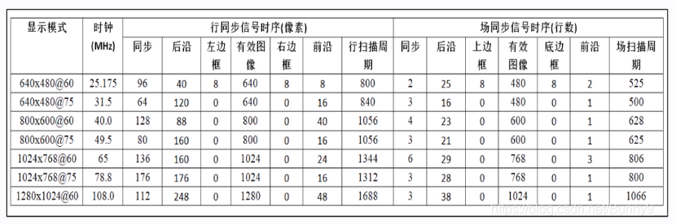](./pic/drm/显示器模式.png)

# 2. DRM架构

## 2.1 框架模型

### 2.1.1 用户态与内核态

用户态到内核态模型如下:

[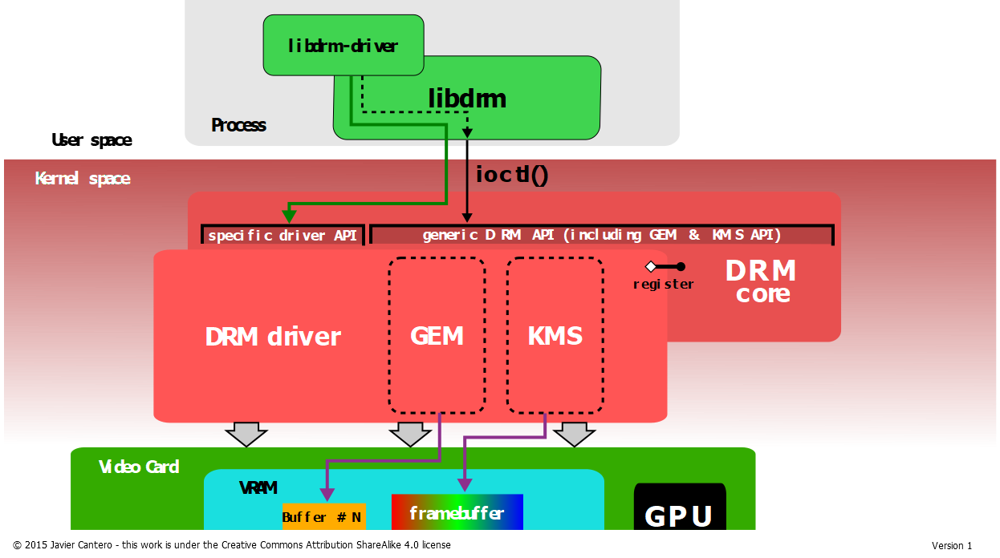](./pic/drm/drm-user-kernel.png)

### 2.1.2 内核态核心结构

核心结构模型如下

[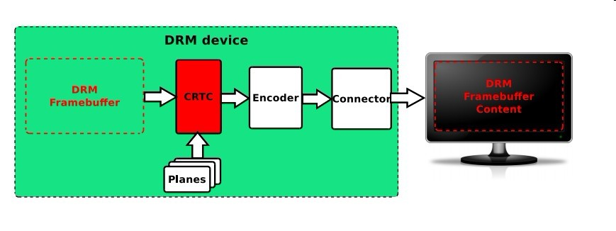](./pic/drm/drm核心结构.png)

相关元素

| 元素 | 说明 |
| :---: | :---: |
| Framebuffer | Framebuffer，单个图层的显示内容 |
| CRTC | 对显示buffer进行扫描，并产生时序信号的硬件模块，通常指Display Controller |
| Planes | 硬件图层，有的Display硬件支持多层合成显示, 所有的Display Controller至少要有1个plane |
| Encoder | 负责将CRTC输出的timing时序转换成外部设备所需要的信号的模块，如HDMI转换器或DSI Controller |
| Connector | 连接物理显示设备的连接器，如HDMI |
| TTM | 内存管理模块, 支持统一内存架构 (UMA) 设备和具有专用视频 RAM 的设备 |
| GEM | 内存管理模块, GEM 比 TTM 具有更简单的初始化和执行要求，但没有视频 RAM 管理功能，因此仅限于 UMA 设备 |
| KMS | Kernel Mode Setting, 模式设置, 包括分辨率、刷新率、电源状态（休眠唤醒）等 |

# 3. DRM 内存管理

## 3.1 内存管理分类

drm核心中有两种内存管理分别为 TTM 和 GEM

## 3.2 TTM (The Translation Table Manager)

基本思想是将资源组合在一定大小的缓冲区对象中，TTM 处理这些对象的生命周期、移动和 CPU 映射。

设计用于管理GPU访问不同类型的内存如Video RAM。 CPU不可直接访问显存, 还需要维护内存一致性, 由于TTM将独显集显与一体化管理, 导致其复杂度高, 在现在系统中, 已经使用更简单的GEM替代TTM。涉及到独显IOMMU使用, 依然使用TTM作为管理, 目前将其部分融入到GEM的API下

支持管理统一内存架构的设备和专用RAM内存设备

## 3.3 GEM (The Graphics Execution Manager)

GEM应对TTM的复杂性, 沿袭了TTM思想，为统一内存架构的设备提供通用库, 但只支持统一内存架构的设备

使用GEM均会创建一个drm_gem_object对象进行管理, 同时支持多种内存分配方式

### 3.3.1 GEM CMA

GEM分配一片连续的大内存，当GPU或display模块不支持MMU时，使用GEM CMA来分配内存需要注意的是，DRM 中的

 CMA helper 和 CMA 本身没有直接关系, 内存分配接口使用的是 `dma_alloc_wc()` , 当开启CMA后`dma_alloc_wc()`, 调用CMA分配内存, 若没开启CMA则使用默认的分配器

核心结构

```C
struct drm_gem_cma_object {
	struct drm_gem_object base;
    dma_addr_t paddr;
    struct sg_table *sgt;
    void *vaddr;
    bool map_noncoherent;
};
```

### 3.3.2 GEM SHMEM

 shmem分配memory, shmem分配的物理页可能不连续。使用shmem可以充分利用缺页异常分配memory的特性，真正建立页表是在用户空间对映射地址进行read/write时，触发缺页异常时，才执行虚拟地址到物理地址的映射

核心结构

```C
struct drm_gem_shmem_object {
    struct drm_gem_object base;
    struct mutex pages_lock;
    struct page **pages;
    unsigned int pages_use_count;
    int madv;
    struct list_head madv_list;
    unsigned int pages_mark_dirty_on_put    : 1;
    unsigned int pages_mark_accessed_on_put : 1;
    struct sg_table *sgt;
    struct mutex vmap_lock;
    void *vaddr;
    unsigned int vmap_use_count;
    bool map_wc;
};
```

### 3.3.3 GEM VRAM

 由视频 RAM (VRAM) 支持的 GEM 缓冲区对象。 它可用于具有专用内存的帧缓冲设备。内核提供辅助函数, 用于创建与管理VRAM

核心结构

```C
struct drm_gem_vram_object {
    struct ttm_buffer_object bo;
    struct iosys_map map;
    unsigned int vmap_use_count;
    struct ttm_placement placement;
    struct ttm_place placements[2];
};
```

## 3.4. 内存管理使用

在 drm_driver 中加入对应的回调函数和文件操作函数

例如: 使用 CMA 作为 drm 的内存管理, 例子如下

```C
DEFINE_DRM_GEM_CMA_FOPS(sun4i_drv_fops);

static struct drm_driver sun4i_drv_driver = {
  .driver_features	= DRIVER_GEM | DRIVER_MODESET | DRIVER_ATOMIC,

  /* Generic Operations */
  .fops			= &sun4i_drv_fops,
  .name			= "sun4i-drm",
  .desc			= "Allwinner sun4i Display Engine",
  .date			= "20150629",
  .major		= 1,
  .minor		= 0,

  /* GEM Operations */
  DRM_GEM_CMA_VMAP_DRIVER_OPS,
  .dumb_create		= drm_sun4i_gem_dumb_create,
};
```

后续在 kms 中获取对应的内存, 需要使用对应的函数, 如获取 cma 映射的内存

```C
gem = drm_fb_cma_get_gem_obj(fb, 0);
	if (!gem)
		return;
```

# 4. DRM KMS

## 4.1 Kernel Mode Setting(KMS)

KMS由FrameBuffer, Plane, Crtc Encoder, Connector等组成, 向应用层提供硬件模式设置如分辨率, 刷新率等功能

DRM 核心将一般流程做成helper函数, 方便使用。

可以在struct drm_xxx_func 中使用helper辅助函数, 将不同芯片实现差异放在 struct drm_xxx_helper_func 中

[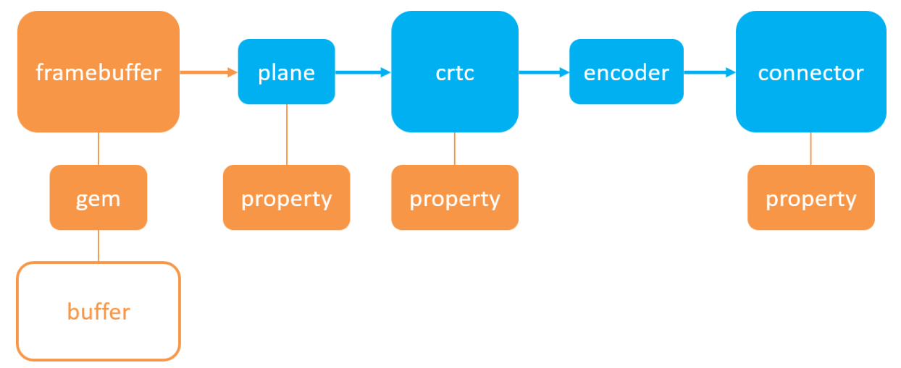](./pic/drm/kms-property.PNG)

## 4.2 Mode Config

涉及全局模式设置的回调函数, 如创建FrameBuffer接口, 通常使用内核提供辅助函数

```C
struct drm_mode_config_funcs {
  struct drm_framebuffer *(*fb_create)(struct drm_device *dev,struct drm_file *file_priv, const struct drm_mode_fb_cmd2 *mode_cmd);
  const struct drm_format_info *(*get_format_info)(const struct drm_mode_fb_cmd2 *mode_cmd);
  void (*output_poll_changed)(struct drm_device *dev);
  enum drm_mode_status (*mode_valid)(struct drm_device *dev, const struct drm_display_mode *mode);
  int (*atomic_check)(struct drm_device *dev, struct drm_atomic_state *state);
  int (*atomic_commit)(struct drm_device *dev,struct drm_atomic_state *state, bool nonblock);
  struct drm_atomic_state *(*atomic_state_alloc)(struct drm_device *dev);
  void (*atomic_state_clear)(struct drm_atomic_state *state);
  void (*atomic_state_free)(struct drm_atomic_state *state);
};
```

## 4.3 FrameBuffer

用于存储显示数据的内存区域, 使用GEM或TTM进行管理

通常由 struct drm_mode_config_funcs 中回调函数填充下列结构体, 创建framebuffer并将其绑定到GEM中

framebuffer 回调函数

```C
struct drm_framebuffer_funcs {
  void (*destroy)(struct drm_framebuffer *framebuffer);
  int (*create_handle)(struct drm_framebuffer *fb,struct drm_file *file_priv, unsigned int *handle);
  int (*dirty)(struct drm_framebuffer *framebuffer,struct drm_file *file_priv, unsigned flags,unsigned color, struct drm_clip_rect *clips, unsigned num_clips);
};
```

## 4.4 Plane

从frame中接收数据, 完成图像裁剪, 修改，叠加等在交由 CRTC 显示，Plane又分为如下3种类型：Cursor (光标图层，一般用于PC系统，用于显示鼠标) 、Overlay (叠加图层，通常用于YUV格式的视频图层) 、Primary (主要图层，通常用于仅支持RGB格式的简单图层), 并不是所有的 CRTC 都有Plane, 但是DRM框架规定，任何一个 CRTC ，必须要有1个Primary Plane, 可以认为 一个 Plane 就是 CRTC 本身

初始化函数

```C
int drm_universal_plane_init(struct drm_device *dev, struct drm_plane *plane, uint32_t possible_crtcs,
                 const struct drm_plane_funcs *funcs, const uint32_t *formats, unsigned int format_count,
                 const uint64_t *format_modifiers, enum drm_plane_type type, const char *name, ...)
```

Plane 回调函数, 通常使用内核提供辅助函数

update_plane: 为更新 fb 图像

若使用 DRIVER_ATOMIC 特性, 则使用内核辅助函数, 由辅助函数完成检测与配置, 最后调用 helper 中的回调函数更新 fb

```C
struct drm_plane_funcs {
  int (*update_plane)(struct drm_plane *plane,struct drm_crtc *crtc, struct drm_framebuffer *fb,int crtc_x, int crtc_y,unsigned int crtc_w, unsigned int crtc_h,uint32_t src_x, uint32_t src_y,uint32_t src_w, uint32_t src_h, struct drm_modeset_acquire_ctx *ctx);
  int (*disable_plane)(struct drm_plane *plane, struct drm_modeset_acquire_ctx *ctx);
  void (*destroy)(struct drm_plane *plane);
  void (*reset)(struct drm_plane *plane);
  int (*set_property)(struct drm_plane *plane, struct drm_property *property, uint64_t val);
  struct drm_plane_state *(*atomic_duplicate_state)(struct drm_plane *plane);
  void (*atomic_destroy_state)(struct drm_plane *plane, struct drm_plane_state *state);
  int (*atomic_set_property)(struct drm_plane *plane,struct drm_plane_state *state,struct drm_property *property, uint64_t val);
  int (*atomic_get_property)(struct drm_plane *plane,const struct drm_plane_state *state,struct drm_property *property, uint64_t *val);
  int (*late_register)(struct drm_plane *plane);
  void (*early_unregister)(struct drm_plane *plane);
  void (*atomic_print_state)(struct drm_printer *p, const struct drm_plane_state *state);
  bool (*format_mod_supported)(struct drm_plane *plane, uint32_t format, uint64_t modifier);
};
```

Plane helper回调函数, 根据实际设备实现函数

```C
struct drm_plane_helper_funcs {
  int (*prepare_fb)(struct drm_plane *plane, struct drm_plane_state *new_state);
  void (*cleanup_fb)(struct drm_plane *plane, struct drm_plane_state *old_state);
  int (*atomic_check)(struct drm_plane *plane, struct drm_atomic_state *state);
  void (*atomic_update)(struct drm_plane *plane, struct drm_atomic_state *state);
  void (*atomic_disable)(struct drm_plane *plane, struct drm_atomic_state *state);
  int (*atomic_async_check)(struct drm_plane *plane, struct drm_atomic_state *state);
  void (*atomic_async_update)(struct drm_plane *plane, struct drm_atomic_state *state);
};
```

## 4.5 Crtc

CRTC 接收从 Plane 过来的数据, 主要完成图像的显示并输出到Encoder中

初始化函数

```C
int drm_crtc_init_with_planes(struct drm_device *dev, struct drm_crtc *crtc, struct drm_plane *primary,
			      struct drm_plane *cursor, const struct drm_crtc_funcs *funcs, const char *name, ...)
```

Crtc 回调函数, 通常使用内核提供辅助函数

```C
struct drm_crtc_funcs {
  void (*reset)(struct drm_crtc *crtc);
  int (*cursor_set)(struct drm_crtc *crtc, struct drm_file *file_priv, uint32_t handle, uint32_t width, uint32_t height);
  int (*cursor_set2)(struct drm_crtc *crtc, struct drm_file *file_priv,uint32_t handle, uint32_t width, uint32_t height, int32_t hot_x, int32_t hot_y);
  int (*cursor_move)(struct drm_crtc *crtc, int x, int y);
  int (*gamma_set)(struct drm_crtc *crtc, u16 *r, u16 *g, u16 *b,uint32_t size, struct drm_modeset_acquire_ctx *ctx);
  void (*destroy)(struct drm_crtc *crtc);
  int (*set_config)(struct drm_mode_set *set, struct drm_modeset_acquire_ctx *ctx);
  int (*page_flip)(struct drm_crtc *crtc,struct drm_framebuffer *fb,struct drm_pending_vblank_event *event,uint32_t flags, struct drm_modeset_acquire_ctx *ctx);
  int (*page_flip_target)(struct drm_crtc *crtc,struct drm_framebuffer *fb,struct drm_pending_vblank_event *event,uint32_t flags, uint32_t target, struct drm_modeset_acquire_ctx *ctx);
  int (*set_property)(struct drm_crtc *crtc, struct drm_property *property, uint64_t val);
  struct drm_crtc_state *(*atomic_duplicate_state)(struct drm_crtc *crtc);
  void (*atomic_destroy_state)(struct drm_crtc *crtc, struct drm_crtc_state *state);
  int (*atomic_set_property)(struct drm_crtc *crtc,struct drm_crtc_state *state,struct drm_property *property, uint64_t val);
  int (*atomic_get_property)(struct drm_crtc *crtc,const struct drm_crtc_state *state,struct drm_property *property, uint64_t *val);
  int (*late_register)(struct drm_crtc *crtc);
  void (*early_unregister)(struct drm_crtc *crtc);
  int (*set_crc_source)(struct drm_crtc *crtc, const char *source);
  int (*verify_crc_source)(struct drm_crtc *crtc, const char *source, size_t *values_cnt);
  const char *const *(*get_crc_sources)(struct drm_crtc *crtc, size_t *count);
  void (*atomic_print_state)(struct drm_printer *p, const struct drm_crtc_state *state);
  u32 (*get_vblank_counter)(struct drm_crtc *crtc);
  int (*enable_vblank)(struct drm_crtc *crtc);
  void (*disable_vblank)(struct drm_crtc *crtc);
  bool (*get_vblank_timestamp)(struct drm_crtc *crtc,int *max_error,ktime_t *vblank_time, bool in_vblank_irq);
};
```

Crtc helper回调函数, 根据实际设备实现函数

dpms: crtc 电源设置, 通常由prepare, commit, diable调用, 在 DRIVER_ATOMIC 特性下不在使用 dpms, 改为 atomic_enable 和 atomic_disable

mode_set: 设置当前分辨率参数, 如 RGB888, Hsync, Vsync等, 在 DRIVER_ATOMIC 特性下不使用

mode_set_base: 获取 fb 地址并更新, 在 DRIVER_ATOMIC 特性下不使用

```C
struct drm_crtc_helper_funcs {
  void (*dpms)(struct drm_crtc *crtc, int mode);
  void (*prepare)(struct drm_crtc *crtc);
  void (*commit)(struct drm_crtc *crtc);
  enum drm_mode_status (*mode_valid)(struct drm_crtc *crtc, const struct drm_display_mode *mode);
  bool (*mode_fixup)(struct drm_crtc *crtc,const struct drm_display_mode *mode, struct drm_display_mode *adjusted_mode);
  int (*mode_set)(struct drm_crtc *crtc, struct drm_display_mode *mode,struct drm_display_mode *adjusted_mode, int x, int y, struct drm_framebuffer *old_fb);
  void (*mode_set_nofb)(struct drm_crtc *crtc);
  int (*mode_set_base)(struct drm_crtc *crtc, int x, int y, struct drm_framebuffer *old_fb);
  int (*mode_set_base_atomic)(struct drm_crtc *crtc,struct drm_framebuffer *fb, int x, int y, enum mode_set_atomic);
  void (*disable)(struct drm_crtc *crtc);
  int (*atomic_check)(struct drm_crtc *crtc, struct drm_atomic_state *state);
  void (*atomic_begin)(struct drm_crtc *crtc, struct drm_atomic_state *state);
  void (*atomic_flush)(struct drm_crtc *crtc, struct drm_atomic_state *state);
  void (*atomic_enable)(struct drm_crtc *crtc, struct drm_atomic_state *state);
  void (*atomic_disable)(struct drm_crtc *crtc, struct drm_atomic_state *state);
  bool (*get_scanout_position)(struct drm_crtc *crtc,bool in_vblank_irq, int *vpos, int *hpos,ktime_t *stime, ktime_t *etime, const struct drm_display_mode *mode);
};
```

## 4.6 Encoder

Encoder 接收 CRTC 传输的数据, 将数据编码成 Connector 需要的信号

初始化函数

```C
int drm_encoder_init(struct drm_device *dev, struct drm_encoder *encoder,
		     const struct drm_encoder_funcs *funcs, int encoder_type, const char *name, ...)
```

Encoder 回调函数, 通常使用内核提供辅助函数

```C
struct drm_encoder_funcs {
  void (*reset)(struct drm_encoder *encoder);
  void (*destroy)(struct drm_encoder *encoder);
  int (*late_register)(struct drm_encoder *encoder);
  void (*early_unregister)(struct drm_encoder *encoder);
};
```

Encoder helper 回调函数, 根据实际设备实现函数

```C
struct drm_encoder_helper_funcs {
  void (*dpms)(struct drm_encoder *encoder, int mode);
  enum drm_mode_status (*mode_valid)(struct drm_encoder *crtc, const struct drm_display_mode *mode);
  bool (*mode_fixup)(struct drm_encoder *encoder,const struct drm_display_mode *mode, struct drm_display_mode *adjusted_mode);
  void (*prepare)(struct drm_encoder *encoder);
  void (*commit)(struct drm_encoder *encoder);
  void (*mode_set)(struct drm_encoder *encoder,struct drm_display_mode *mode, struct drm_display_mode *adjusted_mode);
  void (*atomic_mode_set)(struct drm_encoder *encoder,struct drm_crtc_state *crtc_state, struct drm_connector_state *conn_state);
  enum drm_connector_status (*detect)(struct drm_encoder *encoder, struct drm_connector *connector);
  void (*atomic_disable)(struct drm_encoder *encoder, struct drm_atomic_state *state);
  void (*atomic_enable)(struct drm_encoder *encoder, struct drm_atomic_state *state);
  void (*disable)(struct drm_encoder *encoder);
  void (*enable)(struct drm_encoder *encoder);
  int (*atomic_check)(struct drm_encoder *encoder,struct drm_crtc_state *crtc_state, struct drm_connector_state *conn_state);
};
```

## 4.7 Connector

Connector 接收 Encoder 传输的数据, 并最终显示

初始化函数

```C
int drm_connector_init(struct drm_device *dev, struct drm_connector *connector,
		       const struct drm_connector_funcs *funcs, int connector_type)
```

Connector 回调函数, 通常使用内核提供辅助函数

```C
struct drm_connector_funcs {
  int (*dpms)(struct drm_connector *connector, int mode);
  void (*reset)(struct drm_connector *connector);
  enum drm_connector_status (*detect)(struct drm_connector *connector, bool force);
  void (*force)(struct drm_connector *connector);
  int (*fill_modes)(struct drm_connector *connector, uint32_t max_width, uint32_t max_height);
  int (*set_property)(struct drm_connector *connector, struct drm_property *property, uint64_t val);
  int (*late_register)(struct drm_connector *connector);
  void (*early_unregister)(struct drm_connector *connector);
  void (*destroy)(struct drm_connector *connector);
  struct drm_connector_state *(*atomic_duplicate_state)(struct drm_connector *connector);
  void (*atomic_destroy_state)(struct drm_connector *connector, struct drm_connector_state *state);
  int (*atomic_set_property)(struct drm_connector *connector,struct drm_connector_state *state,struct drm_property *property, uint64_t val);
  int (*atomic_get_property)(struct drm_connector *connector,const struct drm_connector_state *state,struct drm_property *property, uint64_t *val);
  void (*atomic_print_state)(struct drm_printer *p, const struct drm_connector_state *state);
  void (*oob_hotplug_event)(struct drm_connector *connector);
  void (*debugfs_init)(struct drm_connector *connector, struct dentry *root);
};
```

Connector helper 回调函数, 根据实际设备实现函数

get_modes: 获取 edid 信息, 获取显示器分辨率等参数

```C
struct drm_connector_helper_funcs {
  int (*get_modes)(struct drm_connector *connector);
  int (*detect_ctx)(struct drm_connector *connector,struct drm_modeset_acquire_ctx *ctx, bool force);
  enum drm_mode_status (*mode_valid)(struct drm_connector *connector, struct drm_display_mode *mode);
  int (*mode_valid_ctx)(struct drm_connector *connector,struct drm_display_mode *mode,struct drm_modeset_acquire_ctx *ctx, enum drm_mode_status *status);
  struct drm_encoder *(*best_encoder)(struct drm_connector *connector);
  struct drm_encoder *(*atomic_best_encoder)(struct drm_connector *connector, struct drm_atomic_state *state);
  int (*atomic_check)(struct drm_connector *connector, struct drm_atomic_state *state);
  void (*atomic_commit)(struct drm_connector *connector, struct drm_atomic_state *state);
  int (*prepare_writeback_job)(struct drm_writeback_connector *connector, struct drm_writeback_job *job);
  void (*cleanup_writeback_job)(struct drm_writeback_connector *connector, struct drm_writeback_job *job);
};
```

# 5. 驱动流程以及调试问题

## 5.1 版本

内核版本 : 5.4.18

Xorg版本: 1.20.8, 使用 modesetting.so 库

参考: 2500驱动

## 5.2 驱动编写流程

[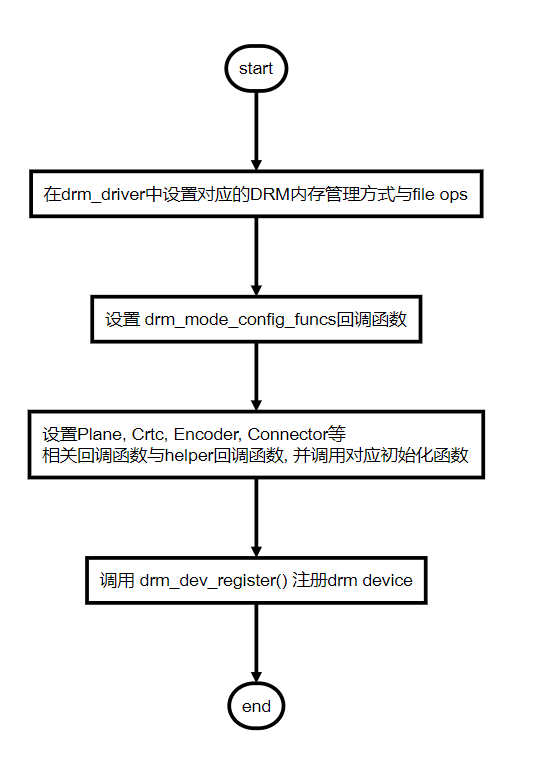](./pic/drm/驱动流程.PNG)

## 5.3 应用层使用流程

具体可以参考 modetest 工具使用

## 5.4 调试工具

### 5.4.1 drm debug打印

打开debug打印， 可以使用dmesg查看drm相关设置等

系统路径

```shell
/sys/module/drm/parameters/debug
```

具体设置值含义，使用如下命令打开

```shell
echo "设置的值" > /sys/module/drm/parameters/debug
```

```C
/*
 * drm_debug: Enable debug output.
 * Bitmask of DRM_UT_x. See include/drm/drm_print.h for details.
 */
unsigned int drm_debug = 0;
EXPORT_SYMBOL(drm_debug);

MODULE_AUTHOR("Gareth Hughes, Leif Delgass, José Fonseca, Jon Smirl");
MODULE_DESCRIPTION("DRM shared core routines");
MODULE_LICENSE("GPL and additional rights");
MODULE_PARM_DESC(debug, "Enable debug output, where each bit enables a debug category.\n"
"\t\tBit 0 (0x01)  will enable CORE messages (drm core code)\n"
"\t\tBit 1 (0x02)  will enable DRIVER messages (drm controller code)\n"
"\t\tBit 2 (0x04)  will enable KMS messages (modesetting code)\n"
"\t\tBit 3 (0x08)  will enable PRIME messages (prime code)\n"
"\t\tBit 4 (0x10)  will enable ATOMIC messages (atomic code)\n"
"\t\tBit 5 (0x20)  will enable VBL messages (vblank code)\n"
"\t\tBit 7 (0x80)  will enable LEASE messages (leasing code)\n"
"\t\tBit 8 (0x100) will enable DP messages (displayport code)");
module_param_named(debug, drm_debug, int, 0600);
```

### 5.4.2 modetest工具

利用此工具可以测试drm驱动能否正常使用, 正常显示图像

#### 5.4.2.1 编译

工具位置在libdrm源码中

源码中路径

```shell
tests/modetest
```

编译命令

```shell
meson builddir
ninja -C builddir/ -j8
```

#### 5.4.2.2 使用

命令参数

```shell
usage: ./modetest [-acDdefMPpsCvrw]

 Query options:

        -c      list connectors
        -e      list encoders
        -f      list framebuffers
        -p      list CRTCs and planes (pipes)

 Test options:

        -P <plane_id>@<crtc_id>:<w>x<h>[+<x>+<y>][*<scale>][@<format>]  set a plane
        -s <connector_id>[,<connector_id>][@<crtc_id>]:[#<mode index>]<mode>[-<vrefresh>][@<format>]    set a mode
        -C      test hw cursor
        -v      test vsynced page flipping
        -r      set the preferred mode for all connectors
        -w <obj_id>:<prop_name>:<value> set property
        -a      use atomic API
        -F pattern1,pattern2    specify fill patterns

 Generic options:

        -d      drop master after mode set
        -M module       use the given driver
        -D device       use the given device

        Default is to dump all info.
```

查看设备属性, 可以知道 plane, crtc, 等设备的属性与id号

 不指定-M 默认从 libdrm 支持列表中查找, -M 指定的名称为 struct drm\_drive r中的name字段, 如果驱动支持 ATOMIC 则需要加 -a

-D 为查找指定设备, 例如设备pci号为 12:00.0

```shell
./builddir/tests/modetest/modetest -M qogir -c -e -f -p
或者
./builddir/tests/modetest/modetest -D pci:0000:12:00.0 -c -e -f -p
```

设置模式

```shell
./builddir/tests/modetest/modetest -M qogir -s 34@32:640x480@XR24 -P 31@32:640x480@XR24
```

### 5.4.3 Xorg 日志

可以通过查看 Xorg 日志了解执行步骤, Xorg 日志系统位置

```shell
/var/log/Xorg.0.log
```

手动运行的命令, 更多的参数参考 man 手册 与 --help 打印

```shell
Xorg -background none :0 -seat seat0 -auth /var/run/lightdm/root/:0 -nolisten tcp vt7 -novtswitch
```

## 5.5 问题

### 5.5.1 Xorg 库与配置文件

#### 5.5.1.1 Xorg 库

Xorg 加载时, 会加载设备对应的动态库(需要配置文件指定特定的库), 如 amd 显卡使用配置文件加载 amdgpu.so, 不使用配置文件则依次加载通用库(具体查看 Xorg 日志)

[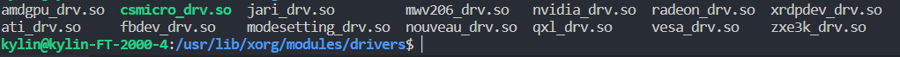](./pic/drm/xorg动态库.PNG)

Xorg 提供通用 modesetting 库, 供一般 drm 驱动使用, 需要 pcie 设备的 class code 为 0x0300 即为 VGA 设备

[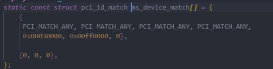](./pic/drm/xorg-pcie.PNG)

系统路径

```shell
/usr/lib/xorg/modules/drivers/modesetting_drv.so
```

modesetting 在 Xorg 源码路径

```shell
hw/xfree86/drivers/modesetting
```

#### 5.5.1.2 配置文件

配置文件包含通用字段和特定库的选项字段, 不存在配置文件时, 采用默认选项加载, 可以使用 man xorg.conf 查看通用的字段

modesetting 库的配置文件详细字段可以参考 man 手册 man modesetting

[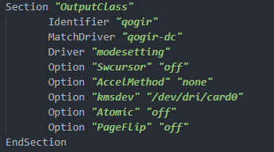](./pic/drm/xorg配置文件.PNG)

modesetting库支持的选项功能如下

[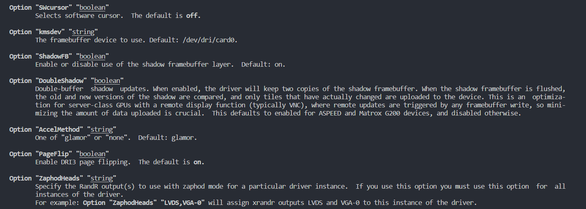](./pic/drm/modesetting选项.PNG)

配置文件存放在系统中的路径如下

```shell
/etc/X11/xorg.conf.d
或者
/usr/share/X11/xorg.conf.d
```

### 5.5.2 内存管理选择

问题: 使用 gem-cma 内存分配时, 当切换 tty 时才会调用 update_plane 的回调函数(触发 dma 传输更新 fb), 无法及时更新 fb 导致

解决: 使用 gem-vram 内存分配, 直接将 fb 与 pcie 设备的 bar 空间关联, 使应用层直接将 fb 放入 pcie bar 空间中, 本地的 dc 设备通常使用 gem-cma 方式

### 5.5.3 ATOMIC 特性设置与Xorg不兼容

内核: 5.4.18内核及其后续版本推荐使用 DRIVER_ATOMIC 特性, 对应 modesetting 函数使用带有 atomic 辅助函数

modesetting.so: 判断驱动是否使用 DRIVER_ATOMIC, 从而后续使用对应 ioctl 命令

[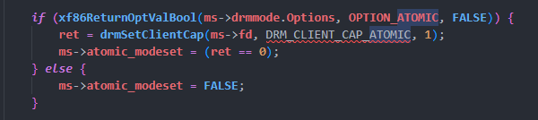](./pic/drm/atomic.PNG)

 问题: 内核中判断进程名称，再进一步是否允许进程能否调用 atomic 相关函数, 由于 Xorg 首字母为X, 导致内核不允许使用atomic函数

[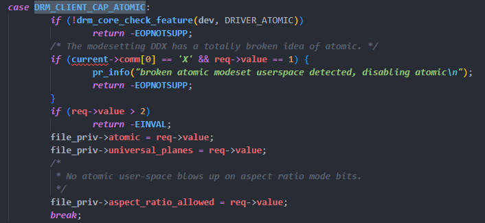](./pic/drm/内核atomic判断.PNG)

解决: 参考5.4.18的2500驱动，不使用 DRIVER_ATOMIC 特性，重新修改驱动

### 5.5.4 设置分辨率

modesetting 通过驱动支持最大分辨率和 EDID 信息选择适合的分辨率, 若无 EDID 信息, 默认使用较低分辨率

注意:

1. 使用 HDMI, xorg 获取 edid 信息后, 使用 640*480 分辨率原因未知, 具体需要查看 xorg 源码
2. 使用 VGA, xorg 获取 edid 信息后, 正常使用对应的分辨率

#### 5.5.4.1 设置分辨率

EDID,Extended display identification data，中文名称扩展显示器识别数据，是VESA在制定DDC显示器数据通道通信协议时，制定的有关显示器识别数据的标准。EDID存储在显示器中的DDC存储器中，当电脑主机与显示器连接后，电脑主机会通过DDC通道读取显示器DDC存储器中的存储的EDID

加入 EDID 信息之后, modesetting 选择合适的分辨率

[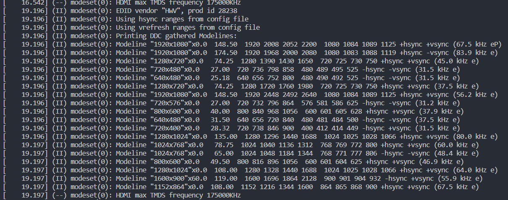](./pic/drm/edid.PNG)

# X. 参考文档及源码

1. [Linux Graphics Stack.pdf](https://bootlin.com/doc/training/graphics/graphics-slides.pdf)
2. [drm-kms.pdf](https://bootlin.com/pub/conferences/2014/elce/brezillon-drm-kms/brezillon-drm-kms.pdf)
3. [libdrm源码](https://gitlab.freedesktop.org/mesa/drm)
4. [Xorg源码](https://gitlab.freedesktop.org/xorg)
5. [Xorg文档](https://www.x.org/releases/current/doc/)
